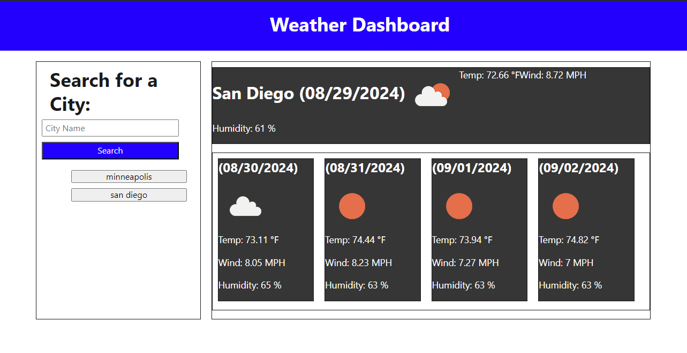

# 06 Server-Side APIs: Weather Dashboard

In this assignment, I created a weather dashboard that resembles the image given from the cohort.
The dashboard makes api calls based on the user's input of a city. The application then displays
the weather for the week including the temperature, wind speed, and humidity. The application also
saves the user's previous searches in local storage to be called again anytime. My version of the 
dashboard does not look the best, but I wanted to focus solely on the functionality of the 
application.

## Link to Deployed Version

https://tjjohnson76.github.io/hw06-Server-Side-APIs/

## Screenshot of Deployed Version

